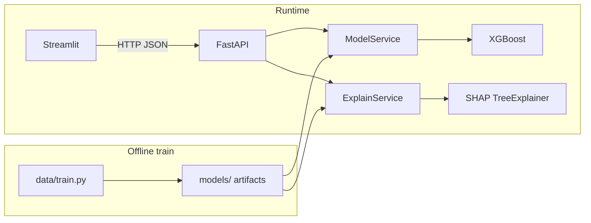

# DecisionLens: Explainable ML Engine

**DecisionLens** is a production-style system for **credit-default / loan-style risk scoring** with **XGBoost**, **SHAP** (global + local), and a **what-if** comparator. It is **not** a notebook demo: it ships a **FastAPI** service, **training pipeline**, and a **Streamlit** dashboard.

## What it does

1. **Predicts** probability of an adverse outcome (label `1` = elevated default risk, framed as HIGH RISK in the API).
2. **Explains** each prediction with **SHAP** (mean |SHAP| globally on a background sample; per-row waterfall drivers locally) and **plain English**.
3. **What-if**: send two full feature vectors (**baseline** vs **scenario**) and receive **delta probability** plus a short interpretation.

### Data and modeling

- **Primary training source**: UCI *default of credit card clients* (Taiwan), cached under `data/raw/`.
- **Cleaning / mapping**: numeric coercion, clipping, and mapping to six user-facing fields plus **three engineered** features (all recomputed at inference from the same six inputs so train/serve stay aligned):
  - `LoanToIncomeRatio`
  - `AffordabilityScore`
  - `CreditEmploymentIndex`
- **Model**: **XGBoost** binary classifier; metrics on hold-out data are stored in `models/metadata.json` (accuracy, precision, recall, ROC-AUC).

> **Note:** In the real UCI pipeline, `Income` is implemented as **credit limit (`LIMIT_BAL`)** — a common proxy in this dataset. The UI labels this explicitly.

## Architecture (brief)

| Layer | Role |
|--------|------|
| `data/train.py` | Download/cache data, feature build, train XGBoost, export `xgb_model.json`, `metadata.json`, `global_shap.json`, `background_X.npy`. |
| `utils/` | Paths, feature engineering, optional numpy metrics. |
| `services/model.py` | Load artifacts, build feature matrix, `predict` / probabilities. |
| `services/explain.py` | `TreeExplainer`, local explanations, global mean \|SHAP\|, copy for stakeholders. |
| `api/main.py` | FastAPI: `/health`, `/predict`, `/explain`, `/what-if`. |
| `ui/app.py` | Dashboard: baseline vs scenario sliders, Plotly waterfall + global bar charts. |



## Run locally

### 1. Environment

```bash
cd /path/to/ml   # repository root containing api/, services/, ui/, data/, utils/

python -m venv .venv
.venv\Scripts\activate          # Windows
# source .venv/bin/activate     # Linux / macOS

pip install -r requirements.txt
```

Set **`PYTHONPATH`** to the repo root so imports resolve:

```powershell
# Windows PowerShell
$env:PYTHONPATH = (Get-Location).Path
```

```bash
# Linux / macOS
export PYTHONPATH=$(pwd)
```

### 2. Train (or rely on API auto-train)

```bash
python data/train.py
```

If `models/xgb_model.json` and `models/metadata.json` are missing, the API can train on startup when `DECISIONLENS_AUTO_TRAIN` is `true` (default).

### 3. API

```bash
python -m uvicorn api.main:app --host 0.0.0.0 --port 8000 --reload
```

- Swagger: `http://127.0.0.1:8000/docs`
- Health (includes stored hold-out metrics): `GET /health`

### 4. UI

```bash
streamlit run run_streamlit.py
```

Open `http://localhost:8511`. Ensure `API_URL` points at the API if not local (default `http://127.0.0.1:8000`).

If Streamlit shows **“Page not found”** then loads the app, use **`run_streamlit.py`** (above), **restart** the Streamlit process after big edits, and do a **hard refresh** (`Ctrl+Shift+R`) or open **`http://127.0.0.1:8511/`** with no extra path in the URL.

### One-shot dev launcher

```bash
python start.py
```

## Docker

```bash
docker compose up --build
```

- API: `http://localhost:8000`
- UI: `http://localhost:8511` (uses `API_URL=http://api:8000`)

The image runs `python data/train.py` at build time so the model layer is present (UCI download requires network during `docker build`).

## Sample API calls

### `POST /predict`

```bash
curl -s -X POST "http://127.0.0.1:8000/predict" ^
  -H "Content-Type: application/json" ^
  -d "{\"Age\": 35, \"Income\": 120000, \"CreditScore\": 640, \"LoanAmount\": 25000, \"EmploymentLength\": 6, \"DebtToIncome\": 32}"
```

**Example response**

```json
{
  "prediction": 0,
  "risk_category": "LOW RISK",
  "probability": 0.214,
  "confidence": 0.786
}
```

### `POST /explain`

Same JSON body as `/predict`. Returns **local** SHAP breakdown (including `plain_english`) and **global** `mean_abs_shap` ranking.

### `POST /what-if`

```json
{
  "baseline": {
    "Age": 35,
    "Income": 80000,
    "CreditScore": 620,
    "LoanAmount": 45000,
    "EmploymentLength": 4,
    "DebtToIncome": 42
  },
  "scenario": {
    "Age": 35,
    "Income": 130000,
    "CreditScore": 700,
    "LoanAmount": 20000,
    "EmploymentLength": 8,
    "DebtToIncome": 22
  }
}
```

**Example response**

```json
{
  "baseline": {
    "prediction": 1,
    "risk_category": "HIGH RISK",
    "probability": 0.71,
    "confidence": 0.71
  },
  "scenario": {
    "prediction": 0,
    "risk_category": "LOW RISK",
    "probability": 0.38,
    "confidence": 0.62
  },
  "delta_probability": -0.33,
  "interpretation": "Scenario decreases estimated risk by 33.0 percentage points versus baseline."
}
```

## Project layout

```
ml/
├── api/main.py           # FastAPI app
├── data/
│   ├── train.py          # Training pipeline
│   └── raw/              # Cached UCI file (created on first train)
├── models/               # Artifacts (generated)
├── services/
│   ├── model.py
│   └── explain.py
├── ui/
│   ├── app.py
│   └── style.css
├── utils/
│   ├── paths.py
│   ├── features.py
│   └── metrics_np.py
├── requirements.txt
├── Dockerfile
├── docker-compose.yml
└── start.py
```

## Configuration

| Variable | Meaning |
|----------|---------|
| `DECISIONLENS_AUTO_TRAIN` | If `true` and model files are missing, API runs `data/train.py` on startup. Set to `false` in strict production and bake artifacts into the image. |
| `API_URL` | Streamlit → backend base URL. |

---

*Built for interview-grade clarity: separated concerns, real SHAP, real HTTP contracts, and a dashboard that is more than default Streamlit widgets.*
